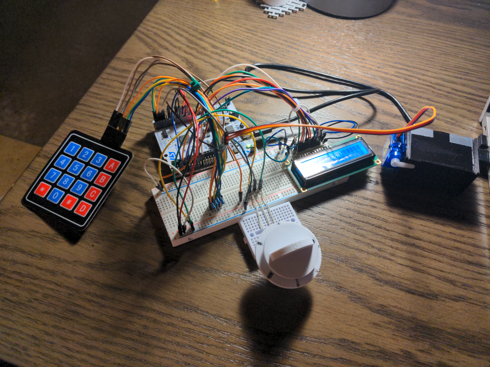

# Portfolio- Elijah Turany
Email: turanye6132@my.uwstout.edu
LinkedIn: [Link](https://www.linkedin.com/in/elijah-t-1500672a2/)
Resume: [Link](Resume/ResumeFall2024.pdf)

## Expense Tracker Software

## Microprocessor Lockbox
I created this project as my final for my Microprocessor System Design final project.
* Coded and built a lockbox utilizing a microprocessor, keypad, potentiometer, and LCD screen
* Wrote bare-metal C code on microprocessor to handle I/O devices and program logic
* Implemented dial-combination and keypad locks using state machines 
* Displayed lock state, entered code, and dynamic instructions on screen

[Video Link](https://liveuwstout-my.sharepoint.com/:v:/r/personal/turanye6132_my_uwstout_edu/Documents/Attachments/2024-05-06-00-16-58-665.mp4?csf=1&web=1&e=oHTt2m&nav=eyJyZWZlcnJhbEluZm8iOnsicmVmZXJyYWxBcHAiOiJTdHJlYW1XZWJBcHAiLCJyZWZlcnJhbFZpZXciOiJTaGFyZURpYWxvZy1MaW5rIiwicmVmZXJyYWxBcHBQbGF0Zm9ybSI6IldlYiIsInJlZmVycmFsTW9kZSI6InZpZXcifX0%3D)
